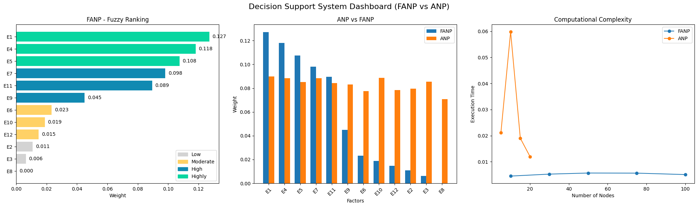

# FuzzyANP
Fuzzy ANP-based decision support system to analyze impulsive buying behavior and identify key influencing factors. This project analyzes factors influencing and explores about phenomena using Fuzzy ANP approach and compares it with classical ANP to evaluate both decision accuracy and computational performance. Focuses on analyzing consumer behavior using a single dataset with multiple evaluation approaches to understand the impact of different factors in decision-making.

### Key Findings
- Classical ANP shows fluctuating execution time as the number of nodes increases  
- Fuzzy ANP demonstrates more stable performance across different scales  
- FANP is more efficient in handling uncertainty without significantly increasing computational cost  

### Insight
Fuzzy ANP not only improves decision accuracy by handling ambiguity, but also maintains stable computational performance, making it suitable for complex decision-making scenarios.

## Key Insights
The top factors influencing impulsive buying behavior are:
1. Emotional attraction when seeing merchandise or illustration has made to merchandise
2. Self-reward motivation  
3. Perceived product exclusivity  

These findings indicate that psychological triggers play a dominant role in consumer purchasing decisions.

## Refined Description (E1–E12)
- E1 – Attraction when encountering merchandise
- E2 – Sudden feelings of boredom or post-purchase regret
- E3 – Anxiety when unable to obtain desired merchandise
- E4 – Restlessness triggered by limited or exclusive items
- E5 – Purchasing merchandise as a form of self-reward
- E6 – Using self-reward as justification for unnecessary purchases
- E7 – Level of awareness and self-control before making a purchase
- E8 – Influence of age on purchasing mindset and behavior
- E9 – Exposure to influence from peers or community
- E10 – Impact of ongoing trends on purchasing decisions
- E11 – Purchasing merchandise as a way to support one’s idol
- E12 – Viewing “oshikatsu” as the ultimate expression of devotion to an idol

## Method
- Fuzzy Analytic Network Process (FANP)
- Fuzzy Geometric Mean (FGM) for preprocessing
- Triangular Fuzzy Numbers (TFN)
- Degree of Possibility
- Pairwise comparison and weighting
- Fuzzy Membership Trapezoidal
- Analytic Network Process (ANP)

## Tools
Python, NumPy, Pandas  

## Impact
This model can be applied to:
- Marketing strategy development  
- Consumer behavior analysis  
- Product positioning

## 📊 Dashboard

